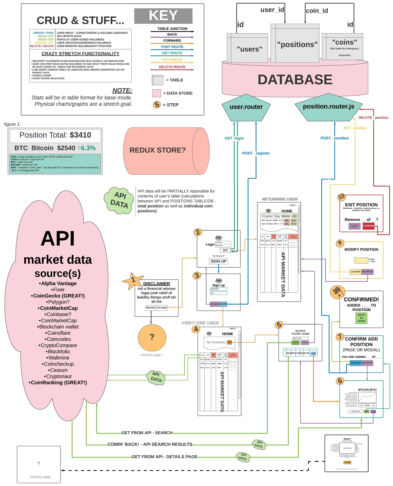

# <b><text align="center">Magic Beans</b>  Cryptofolio 🪙 

# ** **PRE-RELEASE W.I.P.** **   Application is set for initial launch 10/25/21

### <b>A cryptocurrency market data and portfolio tracker for everyone!</b>

---

### _Duration: Two-Week Sprint_ 

 This playful and feature-rich application, named without hesitation by the developer's eight-year-old stepson, was styled for mobile and built to aid in the demystification the role of cryptocurrency in the advanced financial world of today.

 A user is able to see an expanse of realtime market data as well as add assets to and tracktheir own virtual portfolio.

<text align="right">

##### <i>**Please note that Magic Beans **does not** require, encourage or even allow a user to spend real money. Any actual cryptocurrency purchases must be made on qualifying exchanges which follow national and international regulations and adhere to KYC standards. The developer behind the app is not now nor will he ever be a qualified financial planner, accountant, CPA, astronaut, cowboy or ninja.</i>

<text align="left">

---
#####    _(this image represents the detailed, original, conceptual application flowchart. Several days were spent meticulously peeling back layers of API data and planning data paths as well as designing routes. The final product featured the majority of stretch functionality and implemented a few extra features to boot)_

 

 

---
---

<text align="right">

# Prerequisites

---

Internet browser (e.g. Chrome, Firefox, Safari) 
Node.js 
PostgreSQL 
 

<text align='left'>

# Installation
---
- Create a database using the provided .sql file (title the DB <b>"magic_beans"</b>)
- Run `npm install` from the project root directory
- Run `npm run server` to run the node server
- In a separate terminal tab, run `npm run client` to launch the React app
 
 

# Application Use
---

- In order to proceed to the app content, you will need to  to the `disclaimer` landing page.
- `Create an account` or `login` with your username and password to advance.
- If you see a   logo, this means that the real-time market data - as well as your stored portfolio and position information - is loading/calculating. Depending on the status of the market, this could take a few seconds (you can view `CoinGecko's API` status [HERE](https://status.coingecko.com/)).
- At any time, tap the  menu to open a drawer of navigation options. 
- This `actual hamburger menu` features a  which will navigate to the `about page` _(COMING SOON)_.
- If you have not added any crypto holdings yet, you'll be greeted by an empty `positions table`. You can scroll down to browse the top 250 cryptocurrencies (ordered descending by market capitalization) at that particular time. Tapping on any `row` will bring you to a `details page` with a wealth of current market data as well as a 24-hour price chart. The line will be <b>red</b> if the price is lower than it was 24 hours prior and <b>green</b> if it's higher.
- On this `details page`, you can enter any amount of that particular cryptocurrency that you'd like to add to  to `your portfolio`. The following dialogue will allow you to  or  (don't sweat it too much - you can always change this later).
- If you do  the addition of an asset holding, you'll see a friendly `success` dialogue that indicates that you now own a little more of the future of global currency! It even crunches the numbers for you 😃
- From this page, you can always press the  button to navigate to the `search page` or the  button to navigate back to the `home page` where you can see your current portfolio and market data.
- On the `search page`, you can enter any coin by `name`, `ticker` or by a `single letter`. The single letter option will return every currency in the current top 250 that BEGINS WITH THAT LETTER. Pressing the  button will launch the search. Please note that it is possible to return multiple results and continuing to search will stack results on the page. 
- At any time, once results are populated, you can click the  button to navigate to the `coin details page`.
- Alternatively, you can clear the entire search queue by pressing the  button.

- From the `home page`, you can `remove` a position by tapping the  button.
- You can also `modify` a position by tapping the  button. This will bring to a page that allows you to enter a new position amount entirely if you made a mistake, would like to add more or would like to remove some, but not all, from your position.
 

- At any time, inside the  menu, you can tap the  button to `sign out`. 

# Built with
---
[Visual Studio Code](https://code.visualstudio.com/)  
[Pixelmator Pro](https://www.pixelmator.com/pro/)  
[Material UI](https://mui.com/)  
[Moment.js](https://momentj)  
[date-fns](https://date-fns.org/)  
[react-chartjs-2](https://www.chartjs.org/)  
[Gifox](https://gifox.io/)  
[CoinGecko API](https://www.coingecko.com/en/api)  
[Font Awesome](https://fontawesome.com/)  
[Google Fonts](https://fonts.google.com/)  
[Lucid Chart](https://www.lucidchart.com/)  
[Postico](https://eggerapps.at/postico/)  

# License
---
N/A

 

# Acknowledgement
---
I'd like to extend my sincere thanks to my instructors and everyone at [Prime Digital Academy](www.primeacademy.io) - especially [Chris Black](https://github.com/blackcj) and the <b>Proth cohort</b> - for giving me the tools to do amazing things with amazing technology. After years of juggling upwards of 40 cryptocurrency applications and thinking of all the fun stuff I'd love to do if I ever made my own, bringing this to life was a massively profound experience. I almost wish it would never end. 
 

# Support
---
If you have questions or issues - or would like to leave me some feedback - please do not hesitate to email me at: [cmochinski@gmail.com](mailto:cmochinski@gmail.com) or at my GitHub below. I'd sincerely love to hear from you!

---
 

_[My Twitter (@HolyMosesMusic)](https://twitter.com/holymosesmusic)_  
_[My GitHub](https://github.com/chrismochinski)_  
_[My LinkedIn](https://www.linkedin.com/in/chrismochinski/)_ 
